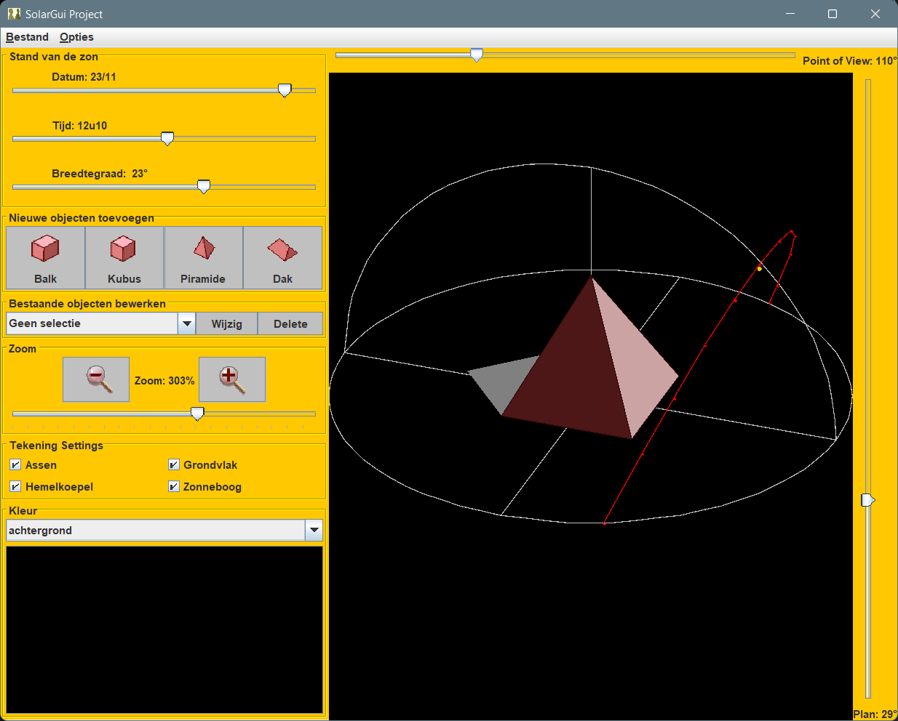

# solar

Visualise shade casting depending on the annual solar position.  
Implemented in 2006 for Bachelor of Science at K.U.Leuven as an exam project for introduction in OOP.

## Screenshots

## How to (NL)

### Starten van de applicatie

Maak gebruik van de run klasse. Deze maakt een instantie van de klasse Beheer aan. 

### Aanmaken van een object

Teken nieuwe balken, kubussen, prismas en piramides via de respectievelijke knoppen. Wanneer u op een van deze knoppen duwt wordt u gevraagd 
het voorwerp te specifieren met

* een naam
* een positie
* een materiaal
* een kleur
* de dimensies

De beschikbare materialen zijn

* kurk
* eikenhout
* asfalt
* glas
* aluminium
* steen
* ijzer

De beschikbare kleuren zijn

* rood
* blauw
* magenta
* geel

Al deze parameters moeten worden ingegeven als lowercase strings.
Vul de velden in en druk op OK.

### Tekenen van een voorwerp

Het voorwerp en zijn schaduwen worden, indien er geen snijdingen zijn met een reeds bestaand voorwerp, getekend volgens deze parameters. Indien er snijdingen zijn wordt de zin "ze snijden" geprint in de terminal.

### Bewerken van voorwerpen

Deze interactie met de voorwerpen zelf verloopt via de GUI. Wanneer u een bestaand voorwerp wil wijzigen, selecteert u de naam van het voorwerp in de "bestaande objecten bewerken"-combobox en drukt u op Wijzig. U wordt dan gevraagd om de huidige parameters aan te passen en op ok te drukken. Bemerk dat wanneer twee objecten dezelfde naam krijgen enkel het laatst aangemaakte object 'actief' is. Het andere is dus tijdelijk onwijzigbaar totdat u de naam van een van de twee opnieuw wijzigt naar een andere waarde.Wanneer u een bestaand voorwerp wil verwijderen, doet u hetzelfde en drukt op Delete.

### Andere GUI interacties

Voorts kan u de positie van de zon veranderen via de drie sliders die respectievelijk de breedtegraad, het uur en de dag bepalen.
U kan ook het gezichtsstandpunt wijzigen via de twee sliders aan de boven en rechterkant van de GUI.

Verder kan u inzoomen op de scene en de kleuren en het uitzicht van de GUI aanpassen via de beschikbare knoppen in de linkeronderhoek van de GUI.

### Voorwerp berekeningen

Het programma voorziet ook enkele functionaliteiten zoals het oproepen van het gemiddelde volume, de gemiddelde massa, de naam van het zwaarste
voorwerp etc. Deze methodes kunnen opgeroepen worden via de klasse beheer via de interactie met objecten in BlueJ. Hiervoor is geen knop in de GUI beschikbaar.

## Demo steps (NL)

1. Teken standaard balk
1. Verplaats zon om schaduw aan te tonen
1. Teken er kubus en piramide bij (ernaast!)
1. Draai zon om schaduw aan te tonen
1. Vraag aantal, zwaarste, gem vol, gem massa op
1. Wijzig locatie van enkele voorwerpen, kleur (laat ze niet overlappen)
1. Geef uitleg bij locatie plaatsing zon, uitleg over de derde parameter
1. Delete kubus (de zwaarste)
1. Vraag zwaarste op (dit is dan balk)
1. Veranderd materiaal piramide naar ijzer
1. Vraag zwaarste op (dit is dan piramide)
1. Verplaats piramide naar oorsprong (locatie balk) waardoor er ‘ze snijden’ opkomt
1. Delete alles, maak prisma in ander kleurtje, andere afmetingen